# Chapter2 homework

## 作业内容
- P174 1,12,16,18
- Reading assignment: Chapter 10.3
- P178 47， 50
- 附加題
- P176 27,34,39,60
- 补充题


### P174 1,12,16,18
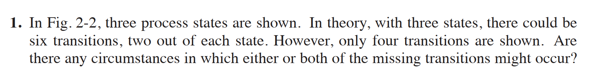
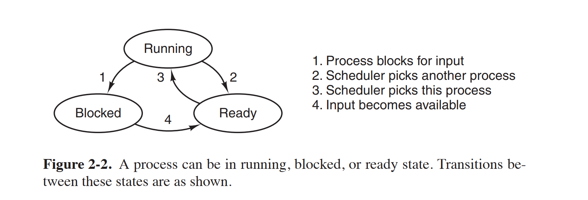
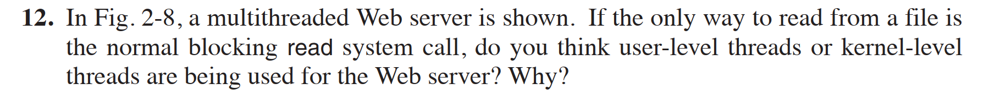
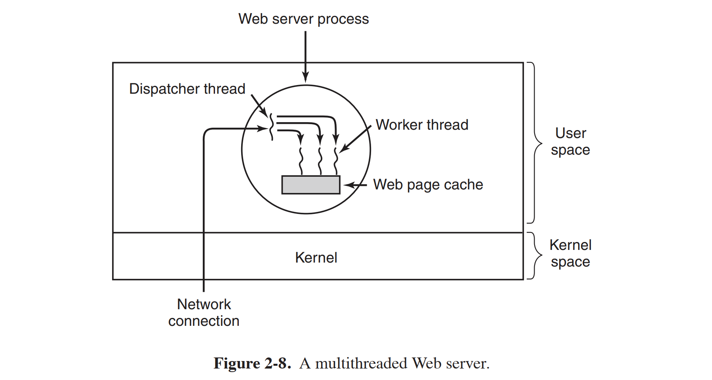
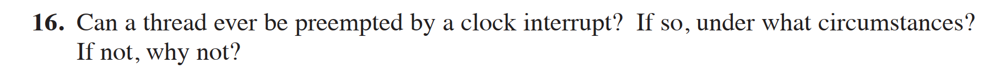
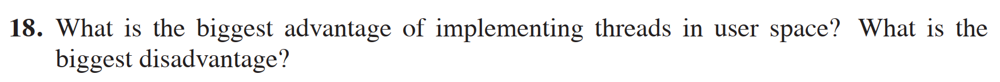

1. In Fig. 2-2, three process states are shown. In theory, with three states, there could be six transitions, two out of each state. However, only four transitions are shown. Are there any circumstances in which either or both of the missing transitions might occur?

12. In Fig. 2-8, a multithreaded Web server is shown. If the only way to read from a file is the normal blocking read system call, do you think user-level threads or kernel-level threads are being used for the Web server? Why?


13. Can a thread ever be preempted by a clock interrupt? If so, under what circumstances? If not, why not?

14. What is the biggest advantage of implementing threads in user space? What is the biggest disadvantage?


### P178 47, 50
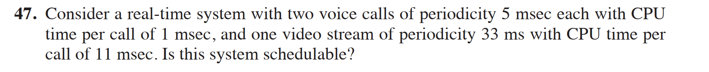
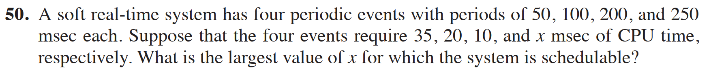


47. Consider a real-time system with two voice calls of periodicity 5 msec each with CPU time per call of 1 msec, and one video stream of periodicity 33 ms with CPU time per call of 11 msec. Is this system schedulable?

50. A soft real-time system has four periodic events with periods of 50, 100, 200, and 250 msec each. Suppose that the four events require 35, 20, 10, and \( x \) msec of CPU time, respectively. What is the largest value of \( x \) for which the system is schedulable?


### 附加题
1. Consider the following set of processes, with the length of CPU burst time given in milliseconds:
    | Process | Duration | Priority | Arrival Time |
    | ------- | -------- | -------- | ------------ |
    | P1      | 10       | 3        | 0            |
    | P2      | 1        | 1        | 0            |
    | P3      | 2        | 5        | 0            |
    | P4      | 1        | 4        | 0            |
    | P5      | 5        | 2        | 0            |


    The processes are assumed to have arrived in the order of P1, P2, P3, P4, P5 all at time 0.

    a. Draw four Gantt charts illustrating the execution of these processes using FCFS, SJF, a non-preemptive priority (a smaller priority number implies a higher priority), and RR scheduling (time quantum=1).

    b. What is the turn around time of each process for each scheduling algorithm in part a?

    c. What is the waiting time of each process for each scheduling algorithm in part a?

    d. Which of the schedules in part a results in the minimal average waiting time?

    

2. There are five jobs A, B, C, D, E, whose arrival time and running time are shown in the table below. The quantum is set to 4. Compute the average turnaround time when the round-robin scheduling strategy is adopted.
    | Job          | A   | B   | C   | D   | E   |
    | ------------ | --- | --- | --- | --- | --- |
    | Arrival Time | 0   | 1   | 2   | 5   | 6   |
    | Running Time | 8   | 4   | 10  | 2   | 3   |

### P176 27,34,39,60

27. In a system with threads, is there one stack per thread or one stack per process when user-level threads are used? What about when kernel-level threads are used? Explain.

34. Can two threads in the same process synchronize using a kernel semaphore if the threads are implemented by the kernel? What if they are implemented in user space? Assume that no threads in any other processes have access to the semaphore. Discuss your answers.

39. Consider the following piece of C code:
```c
void main() {
    fork();
    fork();
    exit();
}
```
How many child processes are created upon execution of this program?

60. Suppose that a university wants to show off how politically correct it is by applying the U.S. Supreme Court’s “Separate but equal is inherently unequal” doctrine to gender as well as race, ending its long-standing practice of gender-segregated bathrooms on campus. However, as a concession to tradition, it decrees that when a woman is in a bathroom, other women may enter, but no men, and vice versa. A sign with a sliding marker on the door of each bathroom indicates which of three possible states it is currently in:
- Empty
- Women present
- Men present

In some programming language you like, write the following procedures: `woman_wants_to_enter`, `man_wants_to_enter`, `woman_leaves`, `man_leaves`. You may use whatever counters and synchronization techniques you like.

```python
import threading

class GenderNeutralBathroom:
    def __init__(self):
        self.lock = threading.Lock()
        self.condition = threading.Condition(self.lock)
        self.current_state = "Empty"  # 状态：Empty/Women/Men
        self.women_count = 0
        self.men_count = 0

    def woman_wants_to_enter(self):
        with self.lock:
            while self.current_state == "Men":
                self.condition.wait()
            self.women_count += 1
            if self.current_state == "Empty":
                self.current_state = "Women"
            self.condition.notify_all()

    def man_wants_to_enter(self):
        with self.lock:
            while self.current_state == "Women":
                self.condition.wait()
            self.men_count += 1
            if self.current_state == "Empty":
                self.current_state = "Men"
            self.condition.notify_all()

    def woman_leaves(self):
        with self.lock:
            self.women_count -= 1
            if self.women_count == 0:
                self.current_state = "Empty"
                self.condition.notify_all()

    def man_leaves(self):
        with self.lock:
            self.men_count -= 1
            if self.men_count == 0:
                self.current_state = "Empty"
                self.condition.notify_all()

# 测试示例
bathroom = GenderNeutralBathroom()

def woman_behavior():
    bathroom.woman_wants_to_enter()
    print("Woman entered")
    # 模拟使用洗手间
    bathroom.woman_leaves()
    print("Woman left")

def man_behavior():
    bathroom.man_wants_to_enter()
    print("Man entered")
    # 模拟使用洗手间
    bathroom.man_leaves()
    print("Man left")

# 模拟并发访问
threads = []
for _ in range(3):
    t = threading.Thread(target=woman_behavior)
    threads.append(t)
for _ in range(2):
    t = threading.Thread(target=man_behavior)
    threads.append(t)

for t in threads:
    t.start()
for t in threads:
    t.join()
```
### 补充题目
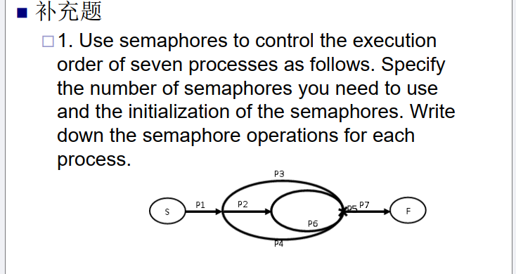
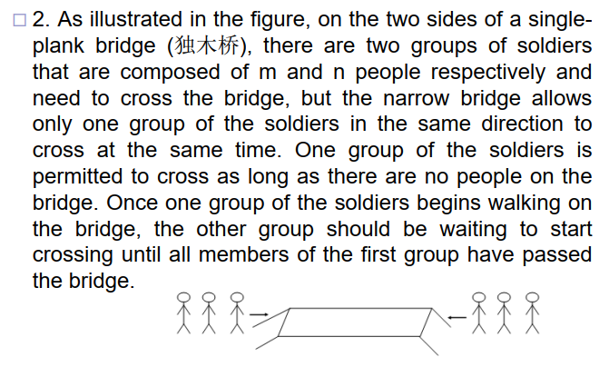
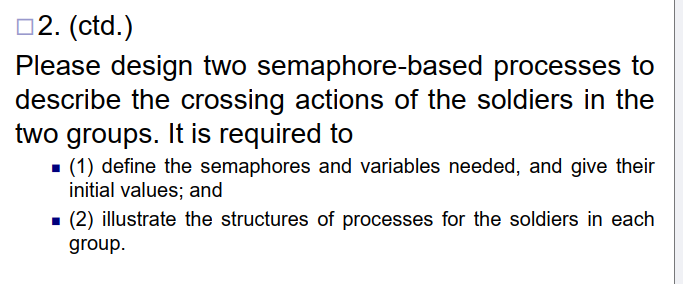