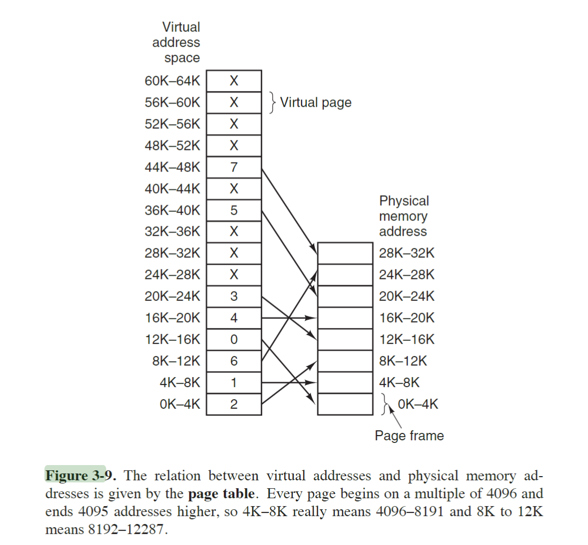

# 3班 蒋昱铭 202330550601

## P254

### 3.

A swapping system eliminates holes by compaction. Assuming a random distribution of many holes and many data segments and a time to read or write a 32-bit memory word of 4 nsec, about how long does it take to compact 4 GB? For simplicity, assume that word 0 is part of a hole and that the highest word in memory contains valid data.

回答：

- 一共需要紧缩 

  $$
  4 \mathrm{GB} / 2   = 2^{31} \mathrm{Byte}
  $$

   的内存空间，移动1bit需要两次读/写。已知移动 
  $$
  2^{5} bits = 4 Byte
  $$

   需要 4ns ,则紧缩需要耗费时间 
  $$
  \frac{2^{31}}{2^2} \times 4ns \times 2 \approx \frac{10^{9}}{2}  \times 4ns \times 2 \approx 4s
  $$

### 4.

Consider a swapping system in which memory consists of the following hole sizes in memory order: 10 MB, 4 MB, 20 MB, 18 MB, 7 MB, 9 MB, 12 MB, and 15 MB. Which hole is taken for successive segment requests of
(a) 12 MB
(b) 10 MB
(c) 9 MB
for first fit? Now repeat the question for best fit, worst fit, and next fit.

#### 回答

- 使用 First Fit (首次适应) 方法：
  $$ 对于 (a) \ 12MB \ 请求: \ 20MB 大小的块会被选择 (剩余 8MB) $$
  $$ 对于 (b) \ 10MB \ 请求: \ 10MB 大小的块会被选择 (剩余 0MB) $$
  $$ 对于 (c) \ 9MB \ 请求: \ 18MB 大小的块会被选择 (剩余 9MB) $$
- 使用 Best Fit (最佳适应) 方法：
  $$ 对于 (a) \ 12MB \ 请求: \ 12MB 大小的块会被选择 (剩余 0MB) $$
  $$ 对于 (b) \ 10MB \ 请求: \ 10MB 大小的块会被选择 (剩余 0MB) $$
  $$ 对于 (c) \ 9MB \ 请求: \ 9MB 大小的块会被选择 (剩余 0MB) $$
- 使用 Worst Fit (最差适应) 方法：
  $$ 对于 (a) \ 12MB \ 请求: \ 20MB 大小的块会被选择 (剩余 8MB) $$
  $$ 对于 (b) \ 10MB \ 请求: \ 18MB 大小的块会被选择 (剩余 8MB) $$
  $$ 对于 (c) \ 9MB \ 请求: \ 15MB 大小的块会被选择 (剩余 6MB) $$
- 使用 Next Fit (下次适应) 方法 (假设初始指针在列表开始，每次分配后指针移到被分配空洞之后)：
  $$ 对于 (a) \ 12MB \ 请求: \ 20MB 大小的块会被选择 (剩余 8MB, 指针移到此块之后) $$
  $$ 对于 (b) \ 10MB \ 请求: \ 18MB 大小的块会被选择 (剩余 8MB, 指针移到此块之后) $$
  $$ 对于 (c) \ 9MB \ 请求: \ 9MB 大小的块会被选择 (剩余 0MB, 指针移到此块之后) $$

### 6.

For each of the following decimal virtual addresses, compute the virtual page number and offset for a 4-KB page and for an 8 KB page: 20000, 32768, 60000.
- 0000 0100 0111 001（小端）、0000 0000 0000 0001（小端序）、0000 0110 0101 0111（小端序）
- 对于 地址1 ：
  - 4KB Page
    - 虚拟页号： $100_2$ ；偏移量：$1110 0010 0000_2$
    - 虚拟页号： $1000_2$ ;偏移量：$0000 0000 0000_2$
    - 虚拟页号： $1110_2$ ;偏移量：$1010 0110 0000_2$
  - 8KB Page:
    - 虚拟页号： $10_2$; 偏移量：$0 1110 0010 0000_2$
    - 虚拟页号： $100_2$ ;偏移量：$0 0000 0000 0000_2$
    - 虚拟页号： $111_2$ ;偏移量：$0 1010 0110 0000_2$
### 7.

Using the page table of Fig. 3-9, give the physical address corresponding to each of the following virtual addresses:
(a) 20
(b) 4100
(c) 8300

- $2 \times 4096 + 20$
- $1 \times 4096 + 4$
- $6 \times 4096 + 108$
### 17.
Suppose that a machine has 38-bit virtual addresses and 32-bit physical addresses.
(a) What is the main advantage of a multilevel page table over a single-level one?
(b) With a two-level page table, 16-KB pages, and 4-byte entries, how many bits should be allocated for the top-level page table field and how many for the next-level page table field? Explain.
- 对于第一小问:节省空间
- 对于第二小问：
  - 需要给第零级页表分配$41(32 + 9) bit \times 512项$
  - 需要给第一级页表分配$18(9 + 9) bit \times 512项$
## P259

### 45.

Explain the difference between internal fragmentation and external fragmentation. Which one occurs in paging systems? Which one occurs in systems using pure segmentation?

- internal fragmentation 是从操作系统视角内看不到的未利用空间，从应用视角看用不到那么多的空闲空间。不可以被操作系统再次分配，需要等待应用主动释放。
- 分页只会产生内部碎片，不会产生外部碎片，因为每个页一旦mapping给进程，操作系统就视他为已经使用过，不是空闲的空间。而且每个也不存在空闲而不能够被分配出去的情况。
- pure segmentation 既会导致内部碎片也会导致外部碎片。

### 47.

We consider a program which has the two segments shown below consisting of instructions in segment 0, and read/write data in segment 1. Segment 0 has read/execute protection, and segment 1 has just read/write protection. The memory system is a demand-paged virtual memory system with virtual addresses that have a 4-bit page number, and a 10-bit offset. The page tables and protection are as follows (all numbers in the table are in decimal):

| Segment 0 Read/Execute |           | Segment 1 Read/Write |           |
| :--------------------- | :-------- | :--------------------- | :-------- |
| Virtual Page #         | Page frame # | Virtual Page #         | Page frame # |
| 0                      | 2         | 0                      | On Disk   |
| 1                      | On Disk   | 1                      | 14        |
| 2                      | 11        | 2                      | 9         |
| 3                      | 5         | 3                      | 6         |
| 4                      | On Disk   | 4                      | On Disk   |
| 5                      | On Disk   | 5                      | 13        |
| 6                      | 4         | 6                      | 8         |
| 7                      | 3         | 7                      | 12        |

For each of the following cases, either give the real (actual) memory address which results from dynamic address translation or identify the type of fault which occurs (either page or protection fault).

(a) Fetch from segment 1, page 1, offset 3
(b) Store into segment 0, page 0, offset 16
(c) Fetch from segment 1, page 4, offset 28
(d) Jump to location in segment 1, page 3, offset 32

- 第一小问的操作返回 1100 0000 0001 11 （小端序）
- 第二小问的操作返回 保护错误 (Protection Fault)
- 第三小问的操作返回 Page Fault
- Access Denied (Protection Fault)
## P333

### 12. 
描述给定文件的损坏数据块对以下情况的影响：  
(a) **连续分配**：  
   - 如果一个数据块损坏，文件的连续部分可能会受到影响，导致部分或全部文件数据不可用。  
   - 由于文件存储在连续的磁盘块中，损坏的块可能会影响文件的完整性。  

(b) **链接分配**：  
   - 如果一个数据块损坏，链表会断裂，导致文件的后续部分无法访问。  
   - 这种方式避免了外部碎片，但随机访问性能较差。  

(c) **索引分配**：  
   - 如果索引表损坏，整个文件可能无法访问。  
   - 如果具体的数据块损坏，则只会影响文件的特定部分。  
   - 这种方式支持快速的随机访问，但需要额外的索引存储空间。

---

### 18. 
考虑一个文件，其大小在其生命周期内从 4 KB 到 4 MB 不等。三种分配方案（连续、链接和表/索引）中哪一种最合适？  

**答案**：  
- **索引分配** 是最合适的，因为它支持文件大小的动态变化。  
- **连续分配** 需要预先分配连续空间，文件大小变化时可能需要重新分配，容易产生外部碎片。  
- **链接分配** 虽然支持动态增长，但随机访问性能较差。  
- **索引分配** 通过索引表管理文件块，既支持动态增长，又能快速随机访问。

---

### 20. 
两名计算机科学专业的学生 Carolyn 和 Elinor 正在讨论 i 节点。Carolyn 认为内存已经变得如此之大且如此便宜，以至于当打开一个文件时，获取 i 节点的新副本到 i 节点表中比搜索整个表以查看它是否已存在更简单、更快。Elinor 不同意。谁是对的？  

**答案**：  
- **Elinor 是对的**。  
- 原因是：  
  - 检查 i 节点表是否已经存在对应的 i 节点，可以避免重复加载，节省内存资源。  
  - 虽然内存变得更大、更便宜，但重复加载 i 节点会浪费资源，尤其是在文件系统中有大量文件时。  
  - 搜索 i 节点表的开销相对较小，通常可以通过优化数据结构（如哈希表）来加速查找。

---

### 21. 
说出硬链接相对于符号链接的一个优点，以及符号链接相对于硬链接的一个优点。  

**答案**：  
- **硬链接的优点**：  
  - 指向文件的实际数据块，效率高。  
  - 文件被删除时，只要硬链接存在，数据不会丢失。  

- **符号链接的优点**：  
  - 可以跨文件系统创建，灵活性更高。  
  - 能够指向目录，而硬链接通常不能指向目录。
