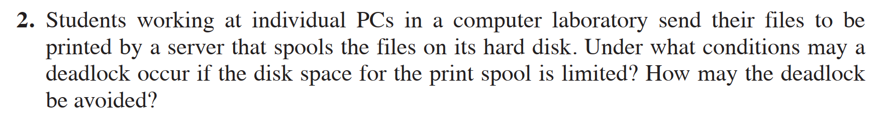
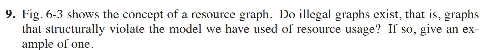
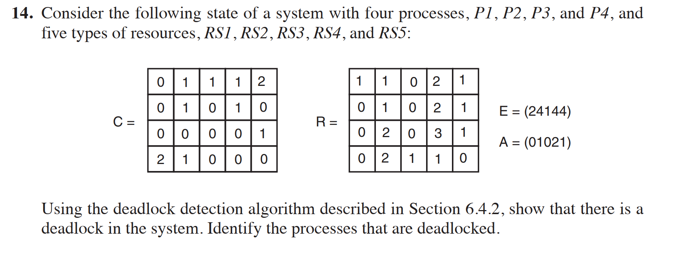
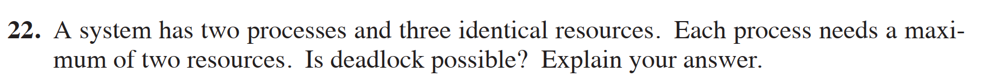
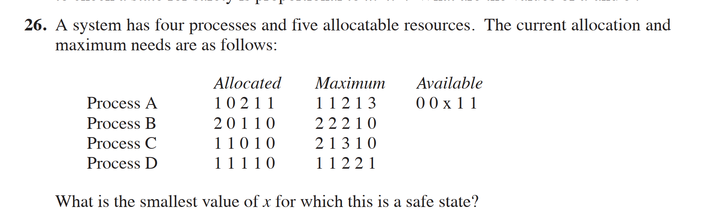
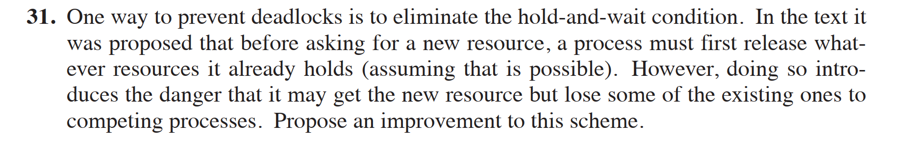

2. 在计算机实验室中使用个人电脑的学生将他们的文件发送到服务器进行打印，服务器将文件假脱机存储在其硬盘上。如果用于打印假脱机的磁盘空间有限，在什么情况下可能会发生死锁？如何避免这种死锁？

9. 图6 - 3展示了资源图的概念。是否存在非法的图，即结构上违反我们所使用的资源使用模型的图？如果存在，给出一个例子。

14. 考虑一个具有四个进程P1、P2、P3和P4以及五种资源类型RS1、RS2、RS3、RS4和RS5的系统的以下状态：
\[
C=\begin{bmatrix}0&1&1&1&2\\0&1&0&1&0\\0&0&0&0&1\\2&1&0&0&0\end{bmatrix}, R=\begin{bmatrix}1&1&0&2&1\\0&1&0&2&1\\0&2&0&3&1\\0&2&1&1&0\end{bmatrix}, E=(24144), A=(01021)
\]
使用6.4.2节中描述的死锁检测算法，证明系统中存在死锁。确定发生死锁的进程。

22. 一个系统有两个进程和三个相同的资源。每个进程最多需要两个资源。是否可能发生死锁？解释你的答案。

26. 一个系统有四个进程和五种可分配资源。当前的分配和最大需求如下：
    | 进程 | 已分配    | 最大需求  | 可用资源  |
    | ---- | --------- | --------- | --------- |
    | A    | 1 0 2 1 1 | 1 1 2 1 3 | 0 0 x 1 1 |
    | B    | 2 0 1 1 0 | 2 2 2 1 0 |           |
    | C    | 1 1 0 1 0 | 2 1 3 1 0 |           |
    | D    | 1 1 1 1 0 | 1 1 2 2 1 |           |
    使这个系统处于安全状态的\( x \)的最小值是多少？

31.  防止死锁的一种方法是消除占有并等待条件。文中提出，在请求新资源之前，进程必须首先释放它已经占有的任何资源（假设这是可能的）。然而，这样做会带来一种危险，即它可能获得新资源，但会将一些现有资源输给竞争进程。提出对该方案的改进。

34.  解释死锁、活锁和饥饿之间的区别。

补充题目：
- 一个系统有五个进程和四种可分配资源。当前的分配和额外需求如下：
    | 进程 | 分配（A B C D） | 需求（A B C D） | 可用（A B C D） |
    | ---- | --------------- | --------------- | --------------- |
    | P1   | 0 0 3 2         | 0 0 1 2         | 1 6 2 2         |
    | P2   | 1 0 0 0         | 1 7 5 0         |                 |
    | P3   | 1 3 5 4         | 2 3 5 6         |                 |
    | P4   | 0 3 3 2         | 0 6 5 2         |                 |
    | P5   | 0 0 1 4         | 0 6 5 6         |                 |
    
    请回答以下问题：
    - （1）这个状态是安全的吗？为什么？
    - （2）P3 的请求（1, 2, 2, 2）可以被批准吗？为什么？