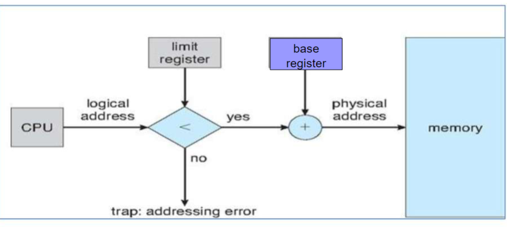

# 3-1 内存管理

## 一、背景：存储器层次结构与管理目标
1. 存储层次结构（Storage Hierarchy）
   - 目标：程序员期望内存兼具 **大容量、高速、低成本、非易失性**，但实际由不同层级组成：
     - 高速缓存（Cache）：少量高速、易失性存储。
     - 主存（RAM）：中等速度、容量，易失性。
     - 外存（磁盘）：大容量、低速、非易失性。
   - 内存管理器职责：监控内存使用、分配 / 回收内存、实现主存与磁盘的交换（Swapping）。
2. 内存分配方案总览
   - 连续分配（Contiguous Allocation）：程序在内存中占连续空间（如单分区、固定分区、可变分区）。
   - 非连续分配（Non-Contiguous Allocation）：程序内存空间不连续（如分页、分段管理，后续章节可能展开）。
3. 内存管理目标
   
## 二、无内存抽象
### **1. 单程序无内存抽象（Mono Program）**  
- **内存组织方式**（图3-1）：  
  - **(a) OS在RAM底部**：早期大型机/小型机使用，用户程序易破坏OS（已淘汰）。  
  - **(b) OS在ROM顶部**：嵌入式设备使用（如掌上设备），OS不可修改。  
  - **(c) 设备驱动在ROM顶部，OS在RAM底部**：早期PC（MS-DOS），BIOS位于ROM，用户程序在中间区域。  
- **单分区分配（Single Partition Allocation）**：  
  - **优点**：简单；缺点：内存利用率低，程序大小受限于内存容量。  
- **覆盖技术（Overlays）**：  
  - **场景**：程序大于内存时，手动划分互斥模块，按需加载到同一内存区域（如两遍汇编器示例）。  
  - **特点**：程序员主导，无OS支持，设计复杂（现代被动态链接库替代）。

### **2. 多程序无内存抽象（Multiple Programs）**  

#### 多程序并发需要解决的问题
- **存储保护 (Storage Protection)**：
  - **原因**：当多个程序同时加载到内存中时，必须确保它们不会相互干扰，也不会破坏操作系统本身。一个程序的错误（如数组越界、指针错误）不应该影响到其他正在运行的程序或操作系统的稳定性。
  - **目标**：为每个程序划分独立的内存空间，并严格限制其只能访问分配给自己的区域。这通常需要硬件支持，例如使用基址寄存器和界限寄存器来定义每个程序可访问的内存范围，或者像后续提到的使用保护键机制。
- **重定位 (Relocation)**：
  - **原因**：程序员在编写和编译程序时，通常无法预知程序最终会被加载到物理内存的哪个具体位置。因此，程序中的地址（如跳转指令的目标地址、数据访问地址）通常是相对于程序开头的逻辑地址（或称为相对地址）。如果直接使用这些逻辑地址，而程序没有被加载到地址0，那么所有内存访问都会出错。
  - **目标**：在程序加载到内存或运行时，需要一种机制将程序中的逻辑地址转换为实际的物理内存地址。这样，同一个程序无论被加载到内存的哪个分区，都能正确执行。后续将详细介绍静态重定位和动态重定位两种主要方法。

#### 多道程序设计 with Swapping 
- 要运行的多个程序的内存映像（程序加载完后的状态）都存储在磁盘中，需要运行时直接复制到内存中运行。
- 通过 Swapping 根本上避免重定位和存储保护问题。
- 一次只加载一个**完整的程序**进入内存中，运行完后交换会磁盘中，磁盘中保存许多程序加载到内存中的内容，以备交换。

#### 多道程序设计 without Swapping
- 将物理内存划分为多个固定或者不固定的内存分区，然后将需要并发运行的多个程序都加载到内存中。

##### 存储保护的方式
- 将物理内存划分为多个固定或者不固定的内存分区，内存块标记上一个保护键，并且比较执行进程的键和其访问的每个内存字的保护键。

##### 解决重定位的方式
- 静态重定位：
  - 在程序加载到内存时，由加载程序（Loader）对程序中的指令地址和数据地址进行修改的过程，将程序中的逻辑地址转换为物理地址，写死在程序中。
  - **工作方式**：加载程序将程序分配到的内存分区的起始地址（基地址）加到程序中所有逻辑地址（通常是相对于程序起始点的地址）上，从而得到实际的物理地址。
  - **特点**：
    - 程序一旦加载到内存并完成重定位后，其在内存中的位置就固定了，不能再移动，否则所有内部的绝对地址引用都会失效。
    - 实现相对简单，不需要特殊的硬件支持。
  - **缺点**：
    - 灵活性差：程序加载后无法移动，可能导致内存碎片难以利用。
    - 难以实现内存共享：如果多个进程需要共享同一段代码或数据，而它们被加载到内存的不同位置，静态重定位会为每个进程生成不同的物理地址，使得共享变得复杂或不可能。

## 三、内存抽象：地址空间

### 1.地址空间的概念
- **定义**：进程可访问的抽象地址集合，独立于物理内存，实现程序与物理地址解耦。  
- **作用**：解决多程序的 **重定位**（动态映射逻辑地址到物理地址）和 **保护**（限制进程访问范围）。

### 2.地址空间抽象的实现：动态重定位。
- **硬件支持**：基址寄存器（Base，地址空间起始）和限长寄存器（Limit，地址空间大小），和MMU(MemoryMappingUnit)负责每次访存的时候进行动态地址转换。
- **地址转换**：物理地址 = 逻辑地址 + 基址寄存器值，超出限长则报错（图3-3）。  
- **优缺点**：  
  - **优点**：允许进程动态移动、支持内存增长；硬件简单（仅两个寄存器）。  
  - **缺点**：每次访问需地址转换（轻微性能开销），进程受限于物理内存大小。
  - 

    
    
图3-3：动态重定位过程

  

### 3.地址绑定（Address Binding）  
- **三个阶段**：  
  - **编译时**：直接生成物理地址（需固定程序加载位置，如MS-DOS的.COM文件）。  
  - **加载时**：生成相对地址（偏移量），加载时转换为物理地址（不可动态重定位）。  
  - **运行时**：动态重定位（逻辑地址在运行时通过硬件转换为物理地址，需基址/限长寄存器）。

### 4. 交换技术与动态重定位结合
- **动态交换**：进程换出后可重新加载到任意空闲分区（仅需更新基址/限长寄存器）。  
- **内存紧凑（Compaction）**：解决交换导致的外部碎片，通过移动进程合并空闲内存（需动态重定位支持）。

## 内存管理策略
### 1. 空闲内存管理（Managing Free Memory）
- **数据结构**：  
  - **位图（Bitmap）**：每个位表示一个内存块是否空闲，适合小单位分配（查找连续空闲块较难）。  
  - **链表（Linked Lists）**：记录空闲/已分配区域的起始地址和长度，支持高效合并相邻空闲块。  

### 2. 存储放置策略（Storage Placement Strategies）
- **连续分配场景下的空闲块选择算法**：  
  - **首次适应（First Fit）**：选择第一个足够大的空闲块，简单但可能产生碎片。  
  - **最佳适应（Best Fit）**：选择最接近需求的空闲块，可能产生大量不可用小块。  
  - **最差适应（Worst Fit）**：选择最大空闲块，避免碎片化但需遍历全表。  
  - **下次适应（Next Fit）**：从上次分配位置开始搜索，性能略优于首次适应。  

